Follow these steps to complete the Customer Churn Prediction simulation using Decision Tree and Random Forest:

1. **Step 1: Dataset Exploration**
   - Observe the **Dataset Overview** section which appears when the simulation starts.
   - Review the raw features such as Customer ID, Contract Type, Tenure, and Monthly Charges.
   - Understand the target variable (**Churn**) and identify the patterns in the data.

   

       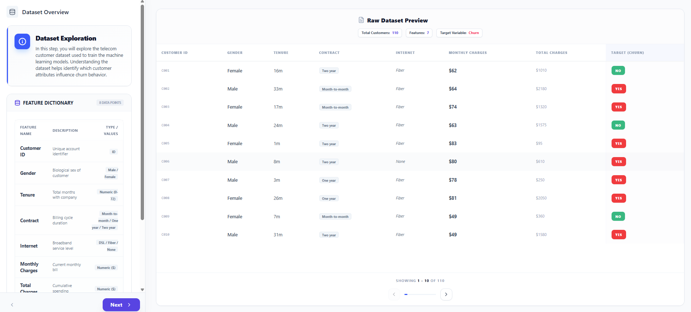
   

2. **Step 2: Data Preprocessing**
   - Navigate to the **Preprocessing** section.
   
   

       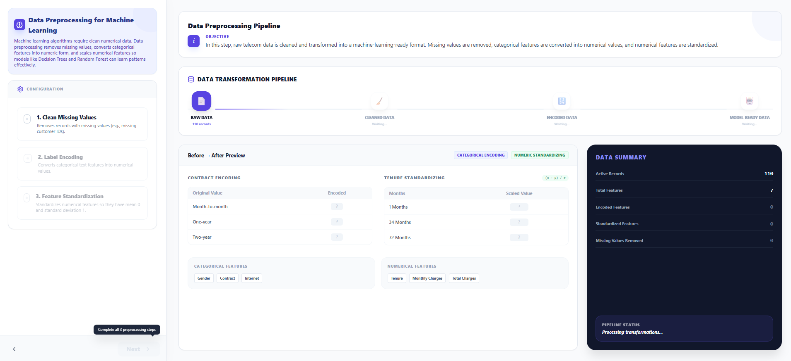
   

   - **Handle Missing Values**: Select the strategy to clean the dataset.
   - **Label Encoding**: Convert categorical text data (like "Contract") into numerical values so the model can process it.
   - **Feature Standardization**: Scale numerical features to a uniform range for better model performance.
   - *Note: All preprocessing steps must be completed to move to the next stage.*

   

       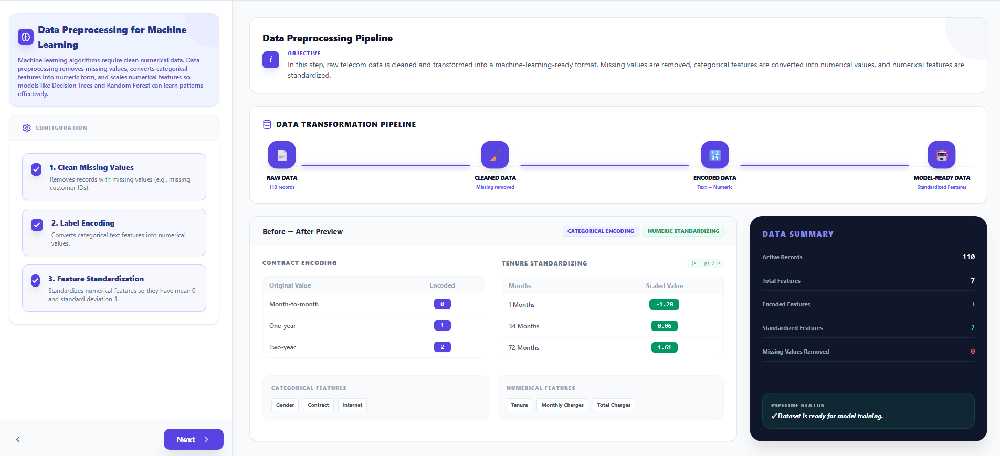
   

3. **Step 3: Dataset Splitting**
   
   

       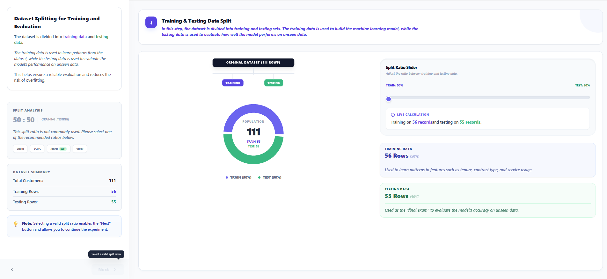
   

   - Use the slider to divide your data into **Training** and **Testing** sets.
   - A common ratio is **80:20** (80% for training the model and 20% for evaluating it).
   - Observe how the records are distributed between the two sets.

   

       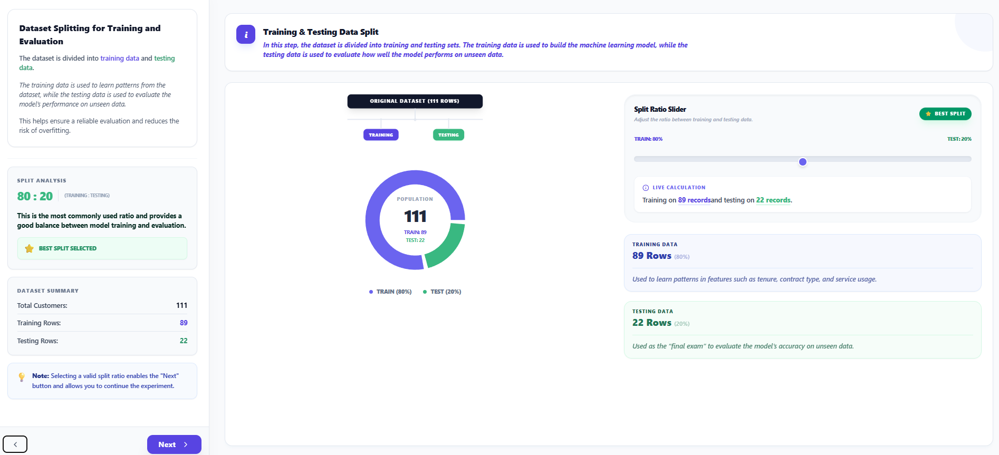
   

4. **Step 4: Decision Tree Configuration**
   - Navigate to the **Decision Tree Setup** section.
   
   

       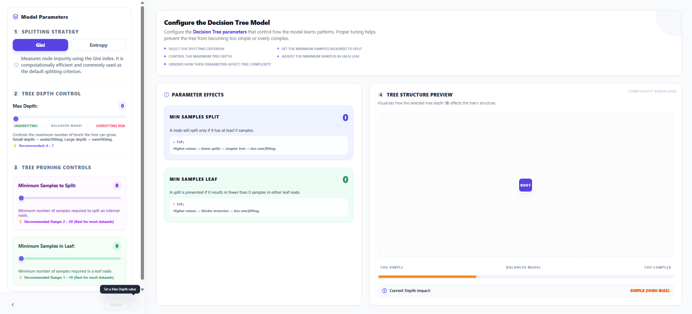
   

   - Configure the **Maximum Depth** and other split criteria like **Gini** or **Entropy**.
   - Read the tips to understand how depth affects model complexity.

   

       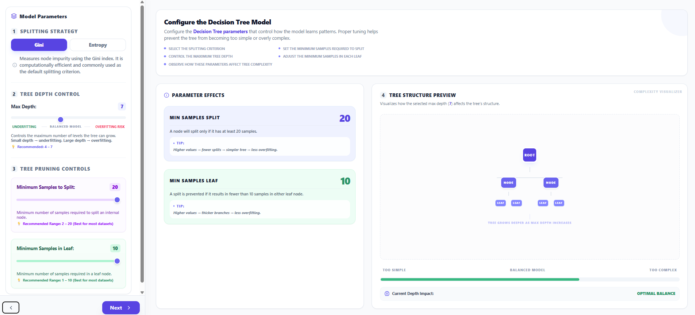
   

5. **Step 5: Train Decision Tree**
   - Click **Execute Training** to build the model.
   
   

       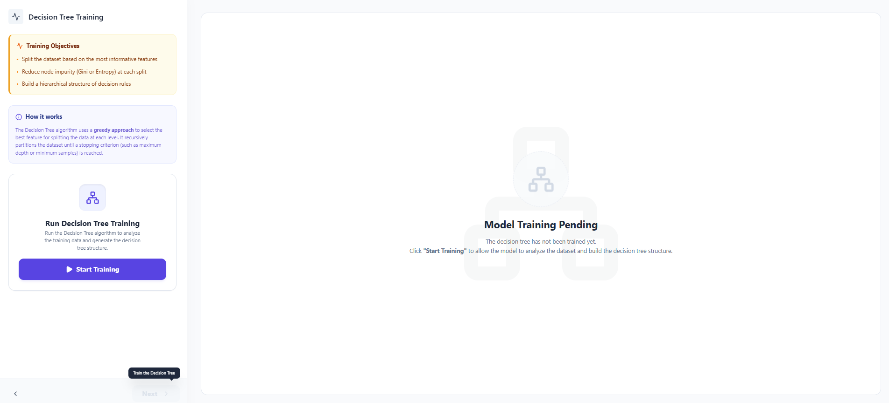
   

   - Visualize the **Decision Tree Structure** and see how the model makes decisions at each node.
   - Review the **Feature Importance** scores to see which factors (like "Contract" or "Internet Service") impact churn the most.

   

       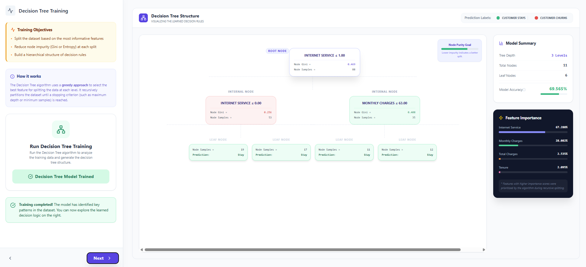
   

6. **Step 6: Random Forest Configuration**
   - Navigate to **Random Forest Parameters**.
   
   

       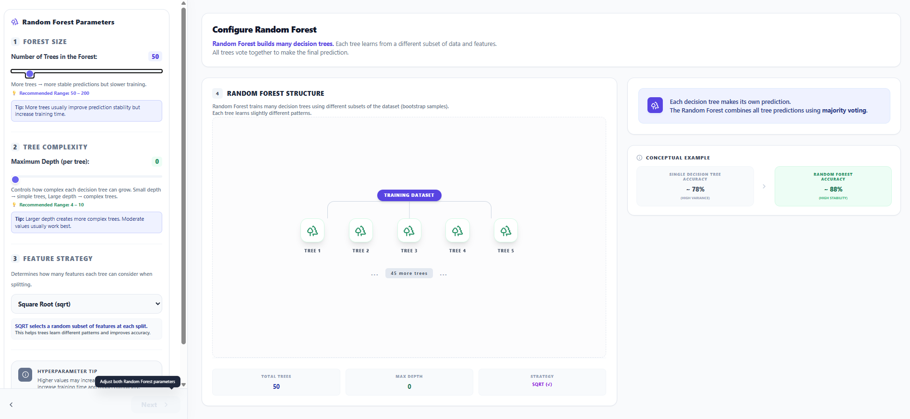
   

   - Set the **Number of Trees** (Forest Size) and **Maximum Depth per tree**.
   - Select a **Feature Strategy** (like SQRT) to ensure diversity among the individual trees.
   - Read the educational tips provided for each parameter.

   

       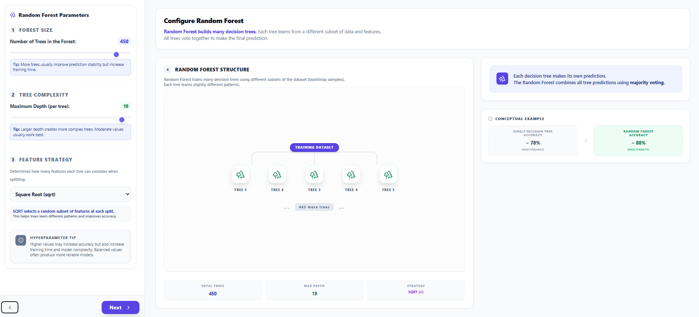
   

7. **Step 7: Train Random Forest**
   - Click **Execute Training** to grow the forest.
   
   

       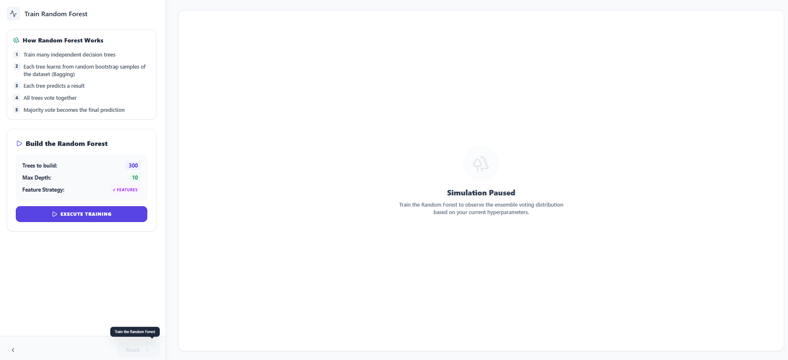
   

   - Observe the **Tree Voting Simulation** as multiple trees independently predict outcomes for a specific test customer.
   - Check the **Prediction Confidence** and the probability breakdown between "Stay" and "Churn."

   

       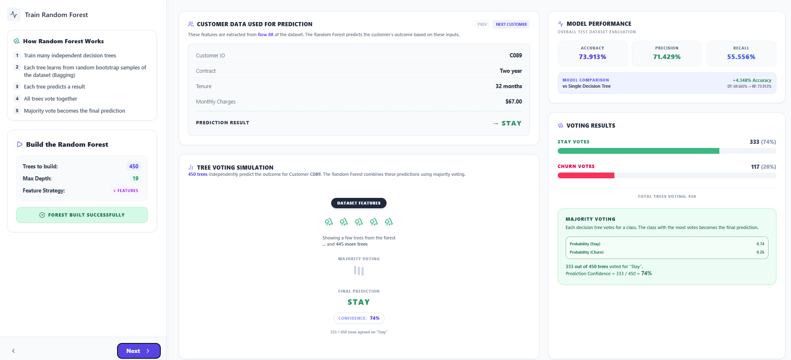
   

8. **Step 8: Model Comparison & Evaluation**
   - Review the final **Performance Metrics** (Accuracy, Precision, Recall) for both models.
   - Compare the **Decision Tree** results against the **Random Forest** results.
   - Read the **Lab Conclusion** and the **Final Evaluation** summary to understand why one model outperformed the other based on ensemble stability and variance.

   

       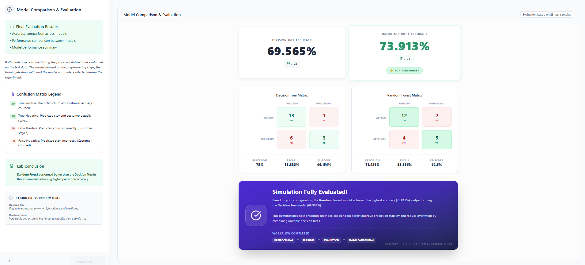
   

