Follow these steps to complete the Customer Churn Prediction simulation using Decision Tree and Random Forest:

 **Step 1: Dataset Exploration**
   - Review the **Feature Dictionary** to understand the attributes (Tenure, Contract, Monthly Charges) used to predict customer behavior.
   - Explore the **Raw Dataset** table to identify patterns in the target variable (**Churn**).
   - Click **"Next Step: Preprocessing"** at the bottom of the navigation panel to continue.

   

       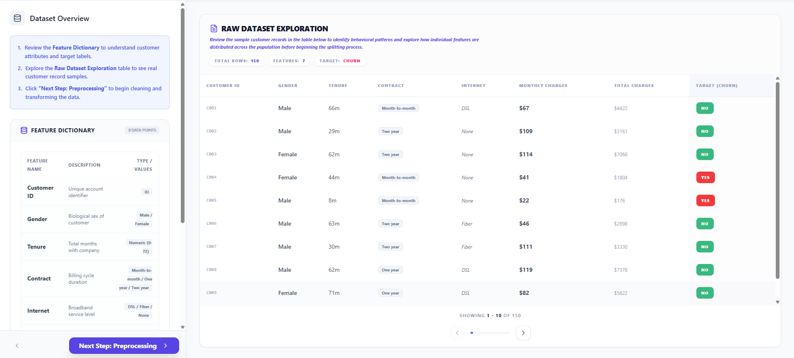
   

 **Step 2: Data Preprocessing**
   - Click **"Run Full Preprocessing"** on the left panel to begin the automated data transformation pipeline.
   - The simulation will sequentially execute the following steps:
     - **Handle Missing Values**: Removes or imputes missing data points to ensure dataset integrity.
     - **Label Encoding**: Converts categorical variables (like "Contract") into numerical representations.
     - **Feature Standardization**: Scales numerical features to a uniform range for optimal model performance.
   - Observe the **Data Transformation Pipeline** animation to visualize these changes in real-time.
   - Click **"Next Step: Data Splitting"** once the process is 100% complete.

   

       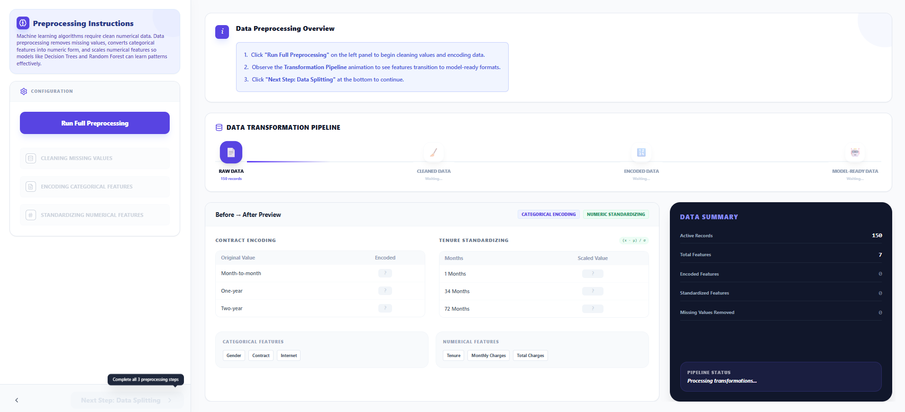
   

   

       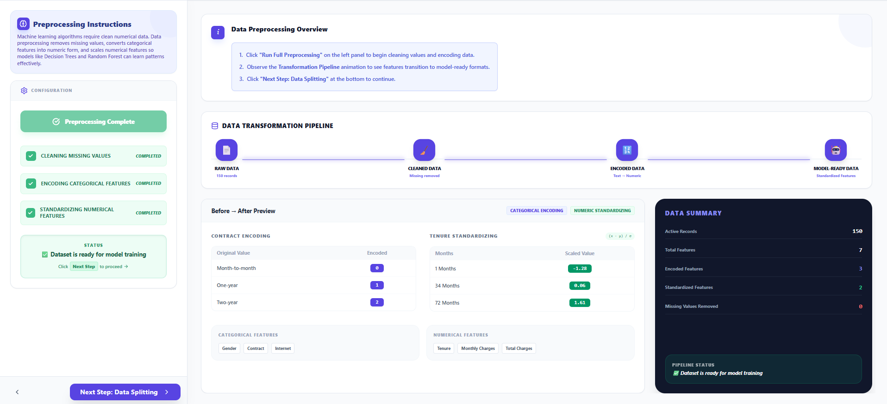
   

 **Step 3: Dataset Splitting**
   - Use the **Split Ratio Slider** to divide your data into **Training** and **Testing** sets.
   - A common ratio is **80:20** (80% for training the model and 20% for evaluating it).
   - Observe the **Live Calculation** results to see how the records are distributed between the two sets.
   - Click **"Next Step: DT Parameters"** to begin model configuration.

   

       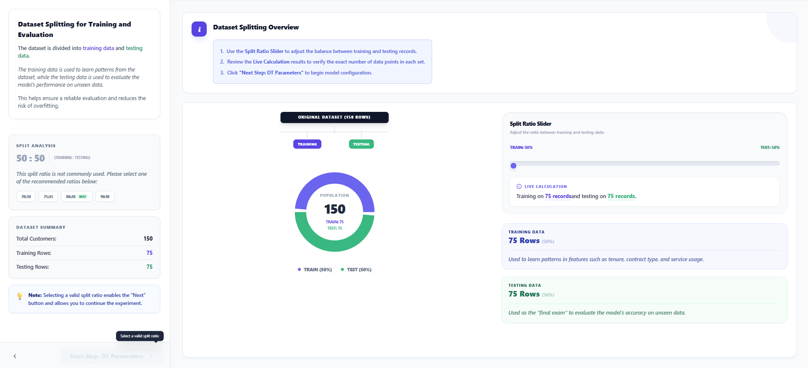
   

   

       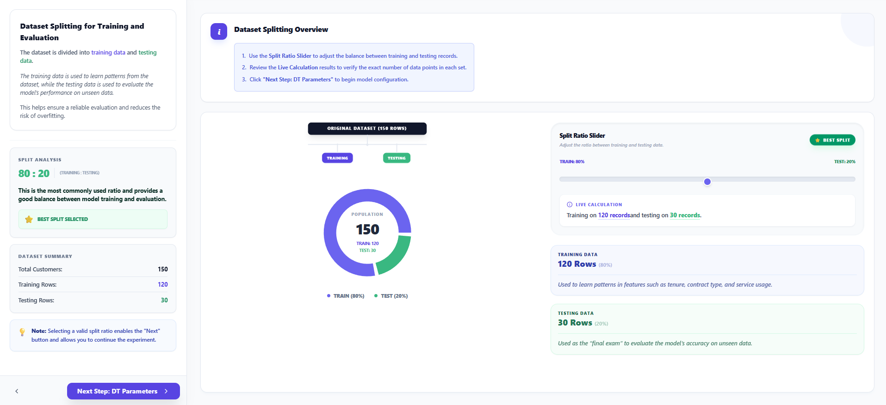
   

 **Step 4: Decision Tree Configuration**
   - Configure the **Maximum Depth** and other **Splitting Criteria** like **Gini** or **Entropy**.
   - Adjust the **Tree Depth and Pruning** controls to manually tune model complexity and reduce overfitting risks.
   - Observe the **Tree Structure Preview** to see how your depth selection affects the potential branching of the tree.
   - Click **"Next Step: DT Training"** to proceed to the training phase.

   

       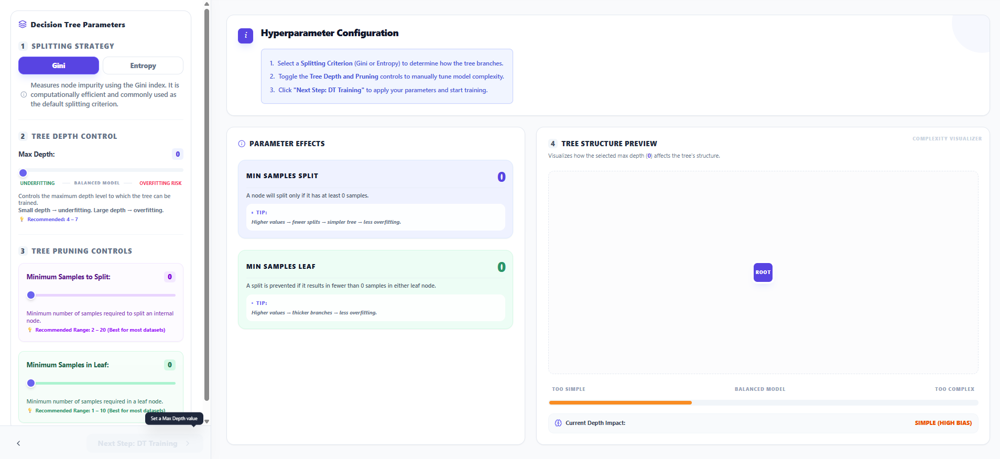
   

   

       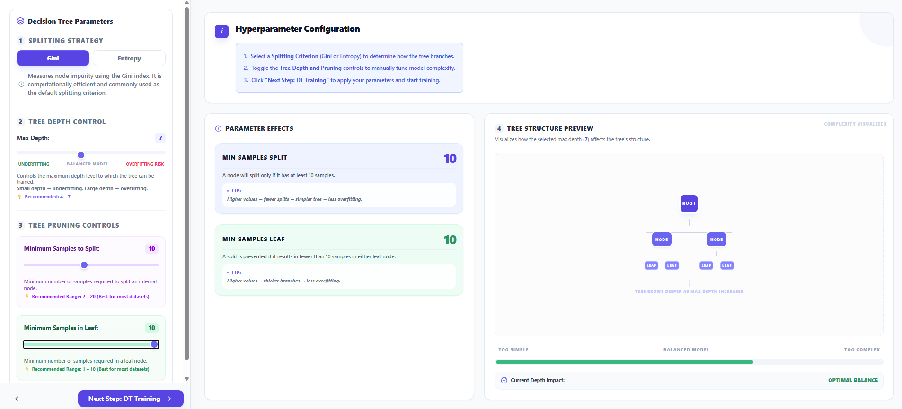
   

 **Step 5: Decision Tree Training**
   - Click **"Start Training"** to execute the recursive partitioning algorithm on your training data.
   - Visualize the resulting **Decision Tree Structure** and see how the model makes specific decisions at each node.
   - Review the **Feature Importance** scores to identify which factors (like "Contract" or "Tenure") impact churn the most.
   - Click **"Next Step: RF Parameters"** to compare this with ensemble methods.

   

       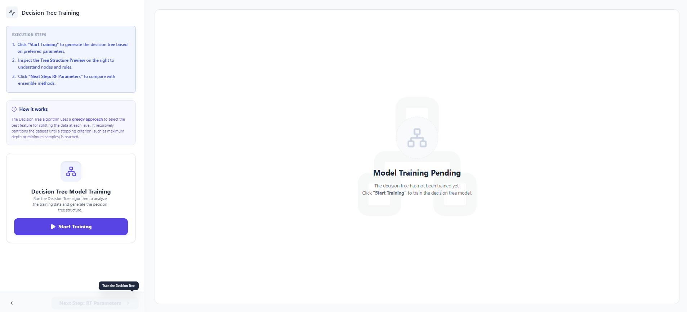
   

   

       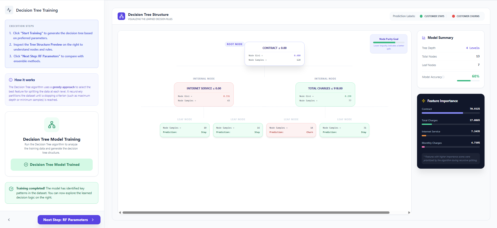
   

 **Step 6: Random Forest Configuration**
   - Set the **Number of Trees** (n_estimators) and the **Maximum Depth** per individual tree.
   - Select a **Feature Strategy** (like SQRT) to ensure feature diversity and improve the stability of the ensemble.
   - Observe the **Random Forest Structure** diagram to understand how bootstrap samples are assigned to different trees.
   - Click **"Next Step: RF Training"** to begin the training process.

   

       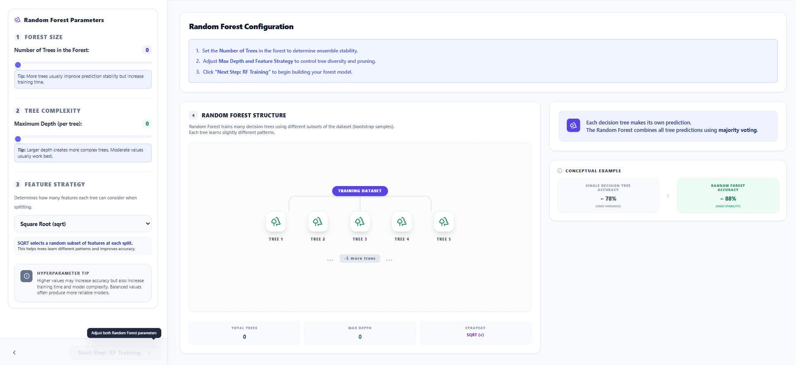
   

   

       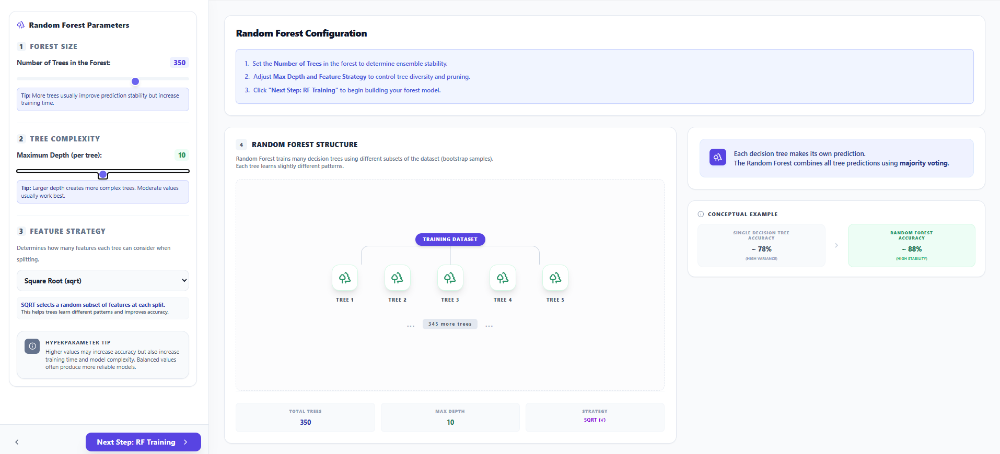
   

 **Step 7: Random Forest Training**
   - Click **"Start Training"** to begin the ensemble voting process for the forest.
   - Observe the **Tree Voting Simulation** as multiple trees independently predict outcomes for a specific test customer.
   - Check the **Prediction Confidence** and the probability breakdown between "Stay" and "Churn" classes.
   - Click **"Next Step: Final Evaluation"** to view the summary results.

   

       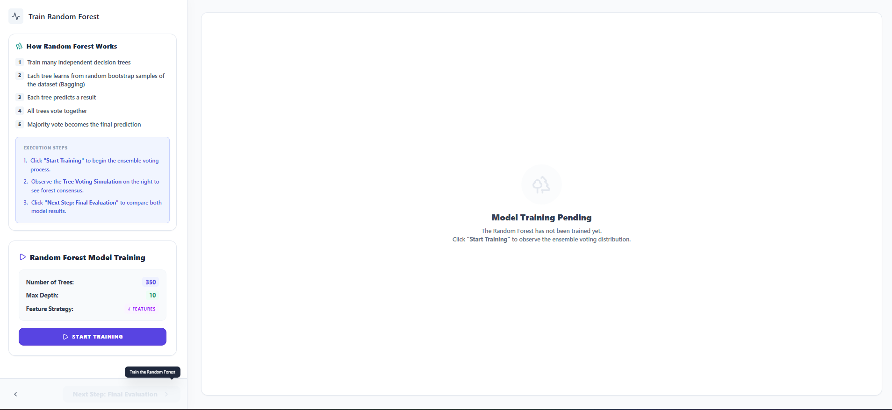
   

   

       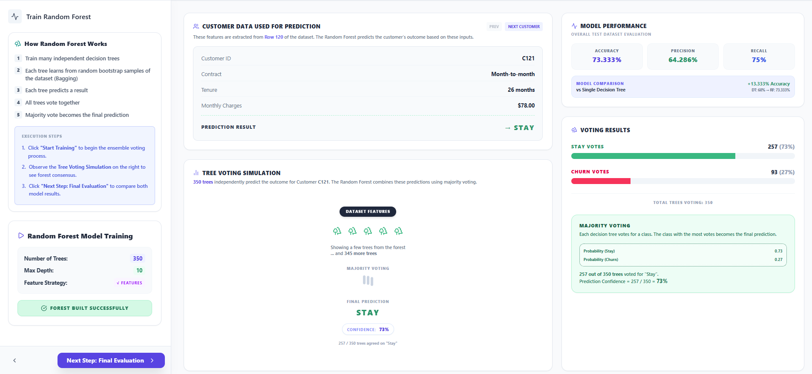
   

 **Step 8: Model Comparison & Evaluation**
   - Review the **Accuracy Comparison** and analyze the **Confusion Matrix Legend** (TP, TN, FP, FN) to identify the top performer.
   - Compare the **Performance Metrics** (Precision and Recall) to evaluate the prediction quality of both models.
   - Click **"Finished"** to complete the laboratory session and review the final conclusion.

   

       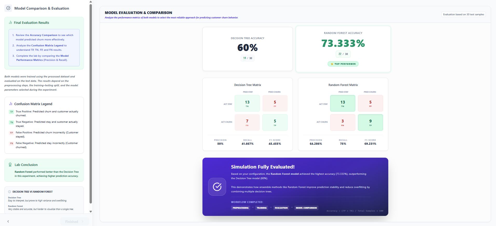
   

